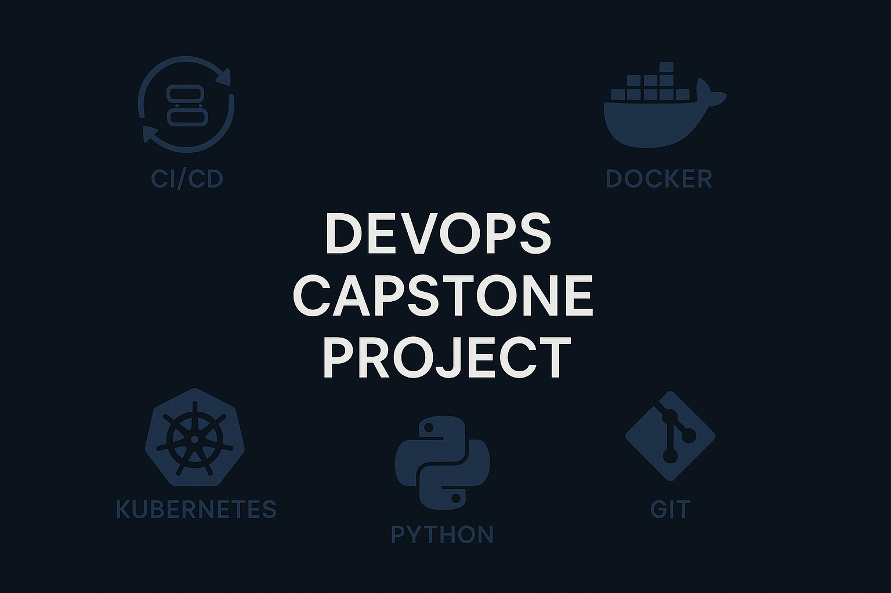
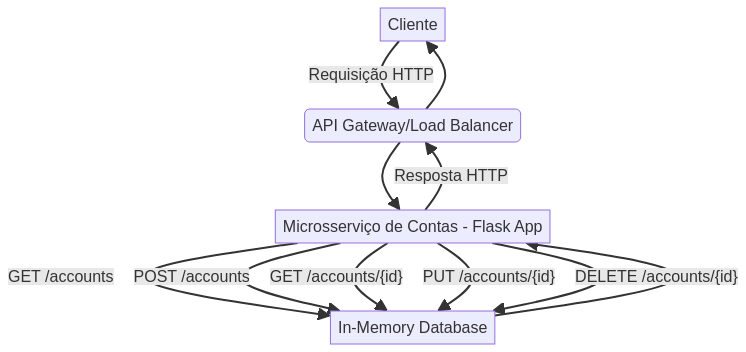

> Este é um repositório bilíngue. Role para baixo para ver a versão em inglês. 🇺🇸

# Projeto Capstone de DevOps


Este repositório é dedicado ao projeto capstone do curso de DevOps, focado no desenvolvimento e implementação de um microsserviço de contas de cliente. O projeto abrange diversas etapas do ciclo de vida de desenvolvimento de software, incluindo planejamento ágil, desenvolvimento orientado a testes (TDD), conteinerização com Docker e orquestração com Kubernetes.

## 🖼️ Imagem Hero



## Visão Geral do Projeto

O objetivo principal é desenvolver um microsserviço de contas que permita criar, ler, atualizar, deletar e listar informações de clientes para um site de e-commerce. Este serviço será construído como uma API REST bem definida, permitindo a integração com outros microsserviços.

O desenvolvimento seguiu práticas ágeis, utilizando o GitHub para gerenciamento de projetos, incluindo quadros Kanban para acompanhamento de sprints e user stories para definição de funcionalidades.

## Arquitetura do Sistema

O microsserviço de contas segue uma arquitetura RESTful, interagindo com um banco de dados em memória para persistência de dados. A comunicação externa é gerenciada por um API Gateway/Load Balancer, garantindo escalabilidade e resiliência.



## Estrutura do Repositório

- `.github/ISSUE_TEMPLATE/`: Contém o template padrão para a criação de user stories.
- `service/`: Contém o código-fonte do microsserviço Flask.
- `tests/`: Contém os testes unitários e de integração para o serviço.
- `Dockerfile`: Arquivo para conteinerização da aplicação Flask.
- `requirements.txt`: Lista as dependências Python do projeto.
- `deployment.yaml`: Manifesto Kubernetes para o Deployment do serviço.
- `service.yaml`: Manifesto Kubernetes para expor o Service.
- `README.md`: Este arquivo, com a documentação do projeto.
- `LICENSE`: Arquivo de licença MIT.
- `.gitignore`: Especifica arquivos e diretórios ignorados pelo Git.
- `setup.cfg`: Arquivo de configuração para ferramentas de teste como pytest.

## Funcionalidades Implementadas

1.  Configuração do ambiente de desenvolvimento e planejamento ágil.
2.  Desenvolvimento de um serviço RESTful para Contas de Cliente com os seguintes endpoints:
    *   `GET /accounts`: Lista todas as contas.
    *   `POST /accounts`: Cria uma nova conta.
    *   `GET /accounts/{id}`: Lê uma conta específica.
    *   `PUT /accounts/{id}`: Atualiza uma conta específica.
    *   `DELETE /accounts/{id}`: Deleta uma conta específica.
3.  Desenvolvimento orientado a testes (TDD) com pytest, alcançando alta cobertura de código.
4.  Conteinerização do microsserviço utilizando Docker.
5.  Deploy da imagem Docker no Kubernetes.

## Tecnologias e Ferramentas

- Python (Flask)
- REST APIs
- Git e GitHub
- Docker
- Kubernetes
- Pytest (para testes)
- Práticas Ágeis (Scrum/Kanban)

## Como Executar o Projeto

### Pré-requisitos

- Git
- Python 3.9+
- Docker
- kubectl (configurado para acessar um cluster Kubernetes)
- Um registro de contêiner (ex: Docker Hub) se for fazer deploy no Kubernetes.

### 1. Clonar o Repositório

```bash
git clone https://github.com/galafis/devops-capstone-project.git
cd devops-capstone-project
```

### 2. Execução Local (sem Docker, para desenvolvimento/testes)

É recomendado criar um ambiente virtual:

```bash
python -m venv venv
source venv/bin/activate  # No Linux/macOS
# venv\Scripts\activate    # No Windows

pip install -r requirements.txt
flask run --port=8000
```

Os testes podem ser executados com:
```bash
pytest
```

### 3. Execução com Docker

#### a. Construir a Imagem Docker

Na raiz do projeto (onde o `Dockerfile` está localizado):

```bash
docker build -t devops-capstone-project:latest .
```

(Se você pretende enviar para um registro como o Docker Hub, use seu nome de usuário: `docker build -t seu_usuario_dockerhub/devops-capstone-project:latest .`)

#### b. Executar o Container Docker

```bash
docker run -p 8000:8000 devops-capstone-project:latest
```

(Se usou seu nome de usuário no build: `docker run -p 8000:8000 seu_usuario_dockerhub/devops-capstone-project:latest`)

A aplicação estará acessível em `http://localhost:8000`.

### 4. Deploy no Kubernetes

#### a. Enviar a Imagem para um Registro de Contêiner

Se você ainda não o fez, envie sua imagem Docker para um registro acessível pelo seu cluster Kubernetes (ex: Docker Hub).

```bash
# Faça login no seu registro (ex: Docker Hub)
# docker login

# Envie a imagem (substitua \'seu_usuario_dockerhub\' se aplicável)
docker push galafis/devops-capstone-project:latest
```

**Importante:** O arquivo `deployment.yaml` está configurado para usar a imagem `galafis/devops-capstone-project:latest`. Se você usou um nome de imagem ou registro diferente, atualize o campo `spec.template.spec.containers[0].image` no arquivo `deployment.yaml` antes de aplicar.

#### b. Aplicar os Manifestos Kubernetes

Na raiz do projeto, onde os arquivos `deployment.yaml` e `service.yaml` estão localizados:

```bash
kubectl apply -f deployment.yaml
kubectl apply -f service.yaml
```

#### c. Verificar o Deploy

```bash
kubectl get deployments
kubectl get pods
kubectl get services devops-capstone-project-service
```

Aguarde até que os pods estejam no estado `Running` e o serviço `devops-capstone-project-service` tenha um `EXTERNAL-IP` (se estiver usando `type: LoadBalancer` e seu provedor de nuvem suportar).

#### d. Acessar a Aplicação no Kubernetes

Use o `EXTERNAL-IP` e a porta exposta pelo serviço (porta 80, conforme `service.yaml`) para acessar a aplicação. Se estiver usando `NodePort`, você precisará do IP de um dos nós do cluster e da `NodePort` atribuída.

## Contribuições

Este projeto foi desenvolvido por Gabriel Demetrios Lafis como parte de um programa de formação. Pull requests e sugestões são bem-vindos para melhorias e aprendizado contínuo.

Este projeto visa demonstrar competências em desenvolvimento full-stack, com ênfase em práticas de DevOps, seguindo as diretrizes do programa de formação IBM Full-Stack JavaScript Developer.

## Licença

Este projeto está licenciado sob a Licença MIT. Consulte o arquivo [LICENSE](LICENSE) para obter detalhes.

---

> This is a bilingual repository. Scroll up for the Portuguese version. 🇧🇷

# DevOps Capstone Project


This repository is dedicated to the DevOps capstone project, focused on the development and implementation of a customer account microservice. The project covers various stages of the software development lifecycle, including agile planning, test-driven development (TDD), containerization with Docker, and orchestration with Kubernetes.

## 🖼️ Hero Image


## Project Overview

The main objective is to develop an account microservice that allows creating, reading, updating, deleting, and listing customer information for an e-commerce website. This service will be built as a well-defined REST API, enabling integration with other microservices.

Development followed agile practices, using GitHub for project management, including Kanban boards for sprint tracking and user stories for feature definition.

## System Architecture

The account microservice follows a RESTful architecture, interacting with an in-memory database for data persistence. External communication is managed by an API Gateway/Load Balancer, ensuring scalability and resilience.


## Repository Structure

- `.github/ISSUE_TEMPLATE/`: Contains the standard template for creating user stories.
- `service/`: Contains the source code for the Flask microservice.
- `tests/`: Contains unit and integration tests for the service.
- `Dockerfile`: File for containerizing the Flask application.
- `requirements.txt`: Lists the Python dependencies of the project.
- `deployment.yaml`: Kubernetes manifest for the service Deployment.
- `service.yaml`: Kubernetes manifest for exposing the Service.
- `README.md`: This file, with project documentation.
- `LICENSE`: MIT License file.
- `.gitignore`: Specifies files and directories ignored by Git.
- `setup.cfg`: Configuration file for testing tools like pytest.

## Implemented Features

1.  Development environment setup and agile planning.
2.  Development of a RESTful service for Customer Accounts with the following endpoints:
    *   `GET /accounts`: Lists all accounts.
    *   `POST /accounts`: Creates a new account.
    *   `GET /accounts/{id}`: Reads a specific account.
    *   `PUT /accounts/{id}`: Updates a specific account.
    *   `DELETE /accounts/{id}`: Deletes a specific account.
3.  Test-driven development (TDD) with pytest, achieving high code coverage.
4.  Containerization of the microservice using Docker.
5.  Deployment of the Docker image on Kubernetes.

## Technologies and Tools

- Python (Flask)
- REST APIs
- Git and GitHub
- Docker
- Kubernetes
- Pytest (for testing)
- Agile Practices (Scrum/Kanban)

## How to Run the Project

### Prerequisites

- Git
- Python 3.9+
- Docker
- kubectl (configured to access a Kubernetes cluster)
- A container registry (e.g., Docker Hub) if deploying to Kubernetes.

### 1. Clone the Repository

```bash
git clone https://github.com/galafis/devops-capstone-project.git
cd devops-capstone-project
```

### 2. Local Execution (without Docker, for development/testing)

It is recommended to create a virtual environment:

```bash
python -m venv venv
source venv/bin/activate  # On Linux/macOS
# venv\Scripts\activate    # On Windows

pip install -r requirements.txt
flask run --port=8000
```

Tests can be run with:
```bash
pytest
```

### 3. Execution with Docker

#### a. Build the Docker Image

In the project root (where the `Dockerfile` is located):

```bash
docker build -t devops-capstone-project:latest .
```

(If you plan to push to a registry like Docker Hub, use your username: `docker build -t your_dockerhub_username/devops-capstone-project:latest .`)

#### b. Run the Docker Container

```bash
docker run -p 8000:8000 devops-capstone-project:latest
```

(If you used your username in the build: `docker run -p 8000:8000 your_dockerhub_username/devops-capstone-project:latest`)

The application will be accessible at `http://localhost:8000`.

### 4. Deploy to Kubernetes

#### a. Push the Image to a Container Registry

If you haven't already, push your Docker image to a registry accessible by your Kubernetes cluster (e.g., Docker Hub).

```bash
# Log in to your registry (e.g., Docker Hub)
# docker login

# Push the image (replace \'your_dockerhub_username\' if applicable)
docker push galafis/devops-capstone-project:latest
```

**Important:** The `deployment.yaml` file is configured to use the `galafis/devops-capstone-project:latest` image. If you used a different image name or registry, update the `spec.template.spec.containers[0].image` field in the `deployment.yaml` file before applying.

#### b. Apply the Kubernetes Manifests

In the project root, where the `deployment.yaml` and `service.yaml` files are located:

```bash
kubectl apply -f deployment.yaml
kubectl apply -f service.yaml
```

#### c. Verify the Deployment

```bash
kubectl get deployments
kubectl get pods
kubectl get services devops-capstone-project-service
```

Wait until the pods are in the `Running` state and the `devops-capstone-project-service` service has an `EXTERNAL-IP` (if you are using `type: LoadBalancer` and your cloud provider supports it).

#### d. Access the Application on Kubernetes

Use the `EXTERNAL-IP` and the port exposed by the service (port 80, as per `service.yaml`) to access the application. If you are using `NodePort`, you will need the IP of one of the cluster nodes and the assigned `NodePort`.

## Contributions

This project was developed by Gabriel Demetrios Lafis as part of a training program. Pull requests and suggestions are welcome for improvements and continuous learning.

This project aims to demonstrate full-stack development skills, with an emphasis on DevOps practices, following the guidelines of the IBM Full-Stack JavaScript Developer training program.

## License

This project is licensed under the MIT License. See the [LICENSE](LICENSE) file for details.

